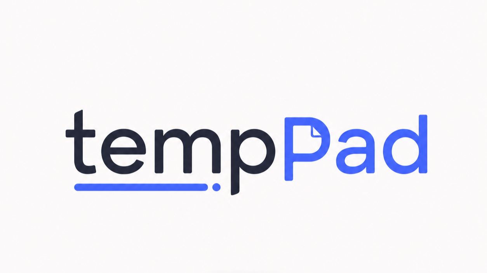

  

<b>轻量临时笔记桌面应用 —— 打开就写，需要留下的再存档。</b>

  
  

---

## 这是什么

tempPad 是一款极简的桌面便签：窗口里几乎只有一张"纸"。随手记下的内容自动保存、重启不丢；值得留下的一键存档，其余的用完即清。它常驻系统托盘，一个全局快捷键随叫随到，驻留时不占 CPU。

## 特性

- **极简界面** — 除了输入区，只有一条细顶栏；所有操作都收在右键菜单里
- **一条临时笔记** — 默认永远是同一张纸，写完存档才会开新的一张
- **自动保存** — 边写边存，未保存状态以小圆点提示（类似 VS Code）
- **浮动列表** — `Ctrl+B` 呼出临时笔记与存档列表，支持搜索，点外部即收起
- **深色模式 / 开机自启** — 托盘右键菜单一键开关，状态自动记住
- **全局快捷键** — `Ctrl+Alt+Space` 随时显示/隐藏窗口
- **完全本地** — 数据存在本机 SQLite 文件里，不联网、无账号、无遥测
- **轻如鸿毛** — 安装包不到 2 MB，驻留托盘时 CPU 占用为零

## 下载安装

**[⬇ 前往最新版本下载页](https://github.com/ChALyX/TempPad-releases/releases/latest)**

| 平台 | 安装包 | 说明 |
| --- | --- | --- |
| Windows 10 / 11（x64） | `TempPad_x.y.z_x64-setup.exe` | 推荐，NSIS 安装向导 |
| Windows 10 / 11（x64） | `TempPad_x.y.z_x64_en-US.msi` | MSI 包，适合企业部署 |
| macOS | 即将推出 | 签名 + 公证版准备中 |

> **安装提示**：安装包暂未进行代码签名，Windows SmartScreen 可能提示"已保护你的电脑"。点击 **更多信息 → 仍要运行** 即可继续安装。

## 常用快捷键

| 快捷键 | 功能 |
| --- | --- |
| `Ctrl+Alt+Space` | 全局显示 / 隐藏窗口 |
| `Ctrl+B` | 打开 / 关闭笔记列表面板 |
| `Ctrl+S` | 立即保存当前笔记 |
| 右键 | 位置感知菜单（存档、清空、复制、删除……） |

## 小贴士

- 关闭窗口 = 收进托盘，并不会退出；真正退出请右键托盘图标 → **退出**
- 存档后会停留在当前笔记上（顶栏出现「已存档」图标），新的空白临时笔记已在后台备好
- 数据文件位于系统应用数据目录下的 `temppad.sqlite3`，备份它即备份全部笔记

## 反馈

使用中遇到问题或有功能建议，欢迎提 [Issue](https://github.com/ChALyX/TempPad-releases/issues)。

*本仓库仅用于发布安装包与说明，源码暂不公开。*
